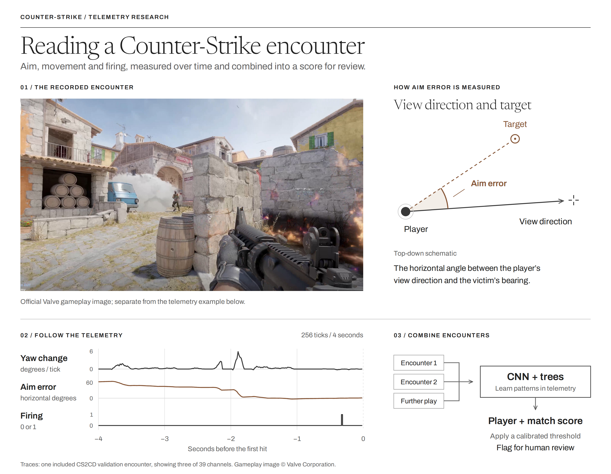

<sub>Gameplay image: [Valve / Counter-Strike 2](https://store.steampowered.com/app/730/CounterStrike_2/). [Illustration sources and data](docs/assets/CREDITS.md).</sub>

# CS2 Anti-Cheat

Research into detecting cheating from aim, movement and shooting telemetry in Counter-Strike. The project starts with a two-layer LSTM and compares it with temporal convolutional networks, Transformers and boosted trees.

**In development.** The current system scores recorded encounters and combines them into a player-match assessment. Live integration and performance on independently collected players remain to be tested.

[Read the report](docs/anticheat_review.pdf) · [Methods](research/METHODS.md) · [Reproduce the work](research/REPRODUCING.md) · [Added files](ADDITIONS.txt)

## What the model sees

The original CS:GO dataset contains five channels: changes in yaw and pitch, horizontal and vertical aim error relative to the victim, and firing. The CS2 pipeline derives 39 channels, adding movement, distance, weapon, recoil and encounter context.

Each CS2 input covers four seconds before the first bullet hit in an encounter. Models combine eligible encounters within a match. The victim is identified retrospectively from the hit; labels describe a player-match and do not identify every moment of cheat activation.

## Results

The **CS2CD benchmark** holds out complete matches. Its test set contains 1,130 eligible player-matches across 120 matches, with 214 positive labels. Selection and thresholds use separate validation and calibration splits.

| Model trained here | Test ROC-AUC | Accuracy |
| :--- | ---: | ---: |
| Always predict non-cheater | 0.500 | 81.1% |
| Original LSTM architecture, 5 channels | 0.917 | 89.0% |
| LSTM, 39 channels | 0.931 | 90.4% |
| Temporal CNN, 39 channels | 0.963 | 93.1% |
| Patch Transformer, 39 channels | 0.946 | 91.3% |
| Boosted trees, 39 channels | 0.968 | 92.2% |
| **Selected CNN and tree blend** | **0.973** | **93.0%** |

Accuracy uses each model's calibration-selected threshold. The blend was selected by validation AUC. Its AUC has a 95% interval of **0.956 to 0.985**, using a bootstrap by match. Its measured advantage over the best tree is uncertain.

At a stricter threshold targeting 1% calibration false positives, the selected model finds **67 of 214** positive-label player-matches and flags **4 of 916** negative-label player-matches: **94.4% precision, 31.3% recall and 0.44% false-positive rate**. Precision depends on cheating prevalence.

The separate **Kaggle benchmark**, with overlapping records grouped before splitting, gives the revised original LSTM **0.843 record AUC / 88.5% accuracy** and the CNN pair **0.859 / 89.3%**, against **84.5% baseline accuracy**. A record contains 30 engagements. The journal's approximately 0.715 AUC scores individual engagements on a different split. [The report](docs/anticheat_review.pdf) explains the comparison and the test-set limitations.

## Run a saved model

Tested with Python 3.13. The included validation example runs on CPU without a dataset download.

```bash
python -m venv .venv
source .venv/bin/activate
python -m pip install -r research/requirements.txt
cd research
python scripts/verify_artifacts.py
python scripts/predict_cs2cd.py examples/example_validation_player.npz --output outputs/example_scores.csv
python -m pytest -q tests
```

On Windows, activate with `.venv\Scripts\Activate.ps1`. [Expected output](research/examples/example_expected_scores.csv) and the [training and inference guide](research/REPRODUCING.md) are included.

## Repository

| Location | Contents |
| :--- | :--- |
| `src/`, `notebooks/` | Original LSTM prototype and exploration |
| `research/anticheat/`, `research/scripts/` | Extraction, training, calibration and inference |
| `research/experiments/` | Models, protocols, predictions and comparisons |
| `research/tests/` | Geometry, data separation and model parity checks |
| `docs/` | Review report and figures |

## Next work

Priorities are an independent cohort with verified labels, consistent player identifiers, skilled legitimate players and known cheat activation intervals. Further experiments can test input-command features, miss-only encounters, a fixed observation period and masked pretraining on gameplay sequences. No text LLM has been fine-tuned or evaluated here.

CS2CD remaps identities in each match, so separation of real people across splits cannot be verified. Some negative labels are unreviewed. Performance covers players with eligible damage encounters, about 94.5% of the release. [Methods and limitations](research/METHODS.md) describe the scope.

## Data and credit

The original prototype was developed by Ionuț. Data comes from [emstatsl's CS:GO dataset](https://www.kaggle.com/datasets/emstatsl/csgo-cheating-dataset) and [CS2CD](https://huggingface.co/datasets/CS2CD/CS2CD.Counter-Strike_2_Cheat_Detection), associated with [AntiCheatPT](https://arxiv.org/abs/2508.06348) by Loo, Lužkov and Burelli. See [data sources and attribution](research/DATA_SOURCES.md) for pinned versions, licenses and processing details.
